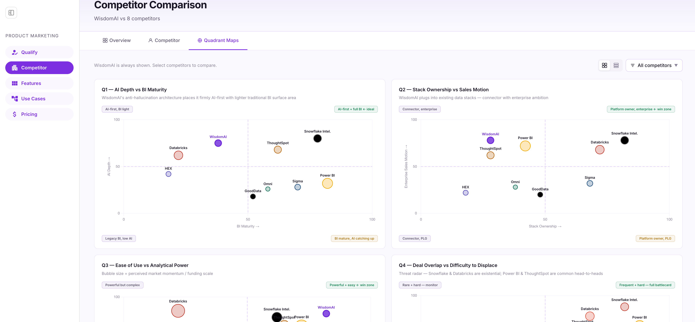
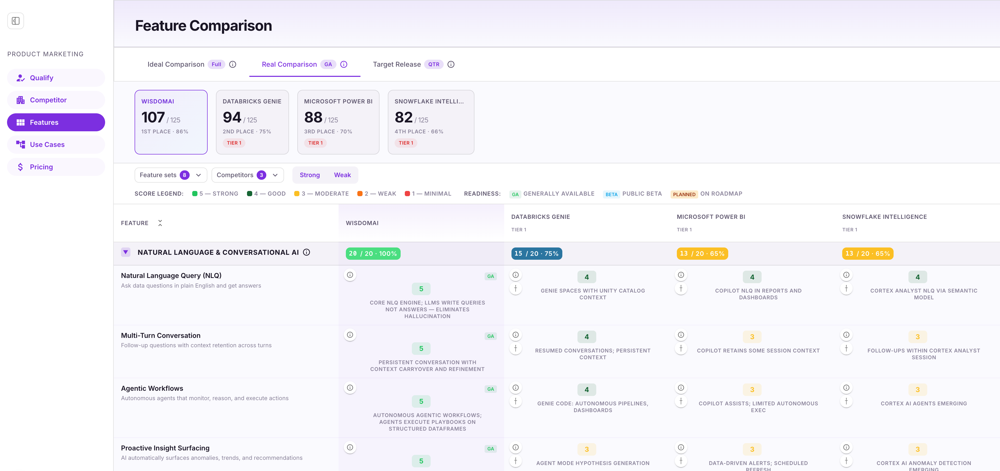
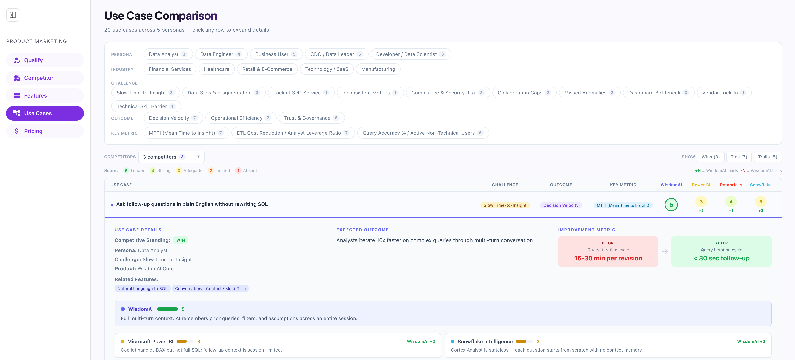
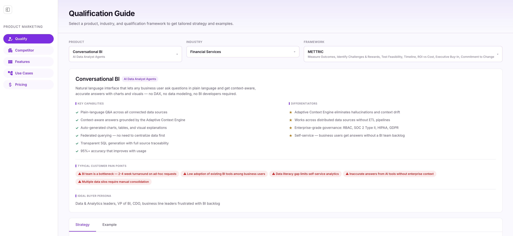
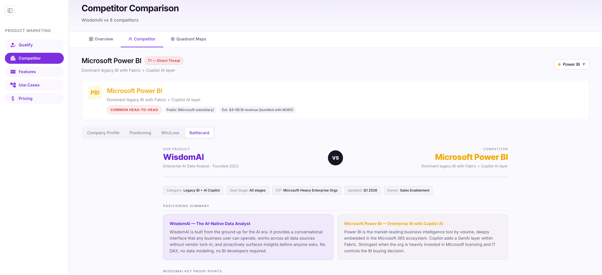
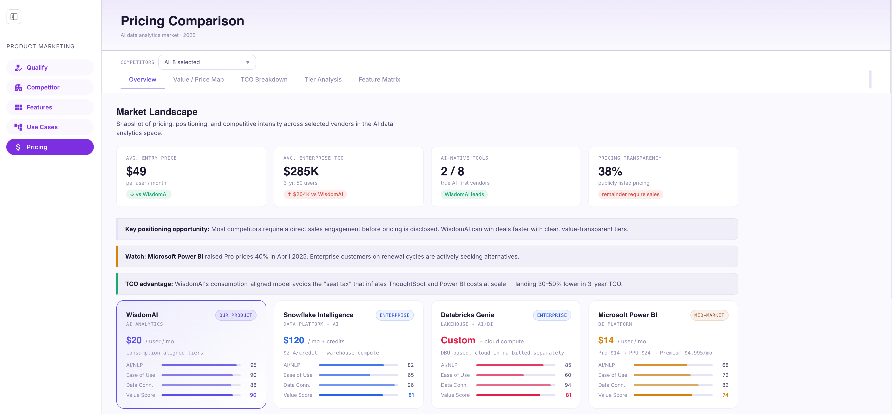

# MCI_App

## How to run the app

The primary app is a Next.js app in the `mci_app` directory.

1. **Install dependencies**

   ```bash
   cd mci_app
   npm install
   ```

2. **Run the development server**

   ```bash
   npm run dev
   ```

Open [http://localhost:3000](http://localhost:3000) in your browser.



3. **Other commands**

   - **Build for production:** `npm run build`
   - **Start production server:** `npm start` (run after `npm run build`)
   - **Run tests:** `npm test`
   - **Lint:** `npm run lint`

## Competitor Comparison Matrix — Business Logic

This page is the **Feature Comparison** experience (feature-level parity between WisdomAI and competitors).

- **Routes**
  - **`/`**: currently routes to the Feature Comparison page (re-export of `app/features/FeatureComparisonPage.tsx`).
  - **`/features`**: explicit route to the same Feature Comparison page.

The matrix powers interactive views, filters, and explanations for sales and product teams.



### Views & inclusion logic

- **Ideal Comparison**
  - Uses the feature's authored score (`wisdom.score`) derived from the feature’s criteria model.
  - All WisdomAI features are included regardless of readiness.
- **Real Comparison (GA view)**
  - Only features where `readiness = GA` are scored for WisdomAI; GA features use their base score, Beta/Planned features count as 0.
  - Category and overall denominators still assume the full set of features in that category (e.g. 3 features → `15` max points), so Real Comparison is a “brutal facts” view of how much of the vision is GA today.
- **Target Release (Quarterly view)**
  - WisdomAI only scores GA or Beta features whose `expectedDate` is on or before the selected quarter end.
  - As in Real view, denominators for categories and overall scores always use the full set of features (each feature contributes up to 5 points), so progress is shown as “delivered vs. full potential by quarter”.

### Feature readiness labels

- **GA** and **Beta** tags are rendered directly above the WisdomAI score pill in each cell.
- **Planned** features use the `expectedDate` to compute a human-readable quarter label:
  - If the date is valid, the label is `Planned: Q{quarter} {year}` (e.g. `Planned: Q3 2026`).
  - If the date is missing or invalid, the label falls back to plain `Planned`.
- In non-ideal views, WisdomAI and unsupported competitor cells for **Planned** features are visually muted to make it clear they do not contribute to current scores.

### Feature-level scoring model & breakdown

- Each feature has an authored WisdomAI score from **0–5**, but internally a 5‑criterion rubric is used:
  - **User Pain Point Resolution**
  - **Ease of Use (UX/UI Friction)**
  - **Depth of Functionality**
  - **Reliability & Performance**
  - **Unique Value Proposition (Differentiator)**
- For now, each criterion reuses the same base `wisdom.score` so totals stay consistent; the criteria exist to support richer explanations and future weighting.
- A **Feature score breakdown** modal is available from the magnifying-glass icon in WisdomAI cells:
  - Shows all five criteria, their descriptions, and any stored rationale (explanations, examples, and links) for that feature and criterion.

### Category, competitor, and overall totals

- **WisdomAI category total** is the sum of `getWisdomScore(feature, view, quarter)` for all features in that category.
- **Competitor category total** is the sum of the competitor’s 0–5 scores for all features in that category; quarterly views only limit WisdomAI based on `expectedDate`, competitor scores do not change per quarter.
- **Overall totals** (summary cards at the top):
  - WisdomAI and each competitor’s total is the sum of their category totals, restricted to the currently visible feature categories.
  - The denominator `maxPossible` is computed as `5 * number_of_features_across_visible_categories`, regardless of view; Real and Target Release views adjust only the **numerator** by zeroing out excluded WisdomAI features.

### Score legend & pill colors

Individual 0–5 scores use a discrete color scale (`--score-1` … `--score-5`):

- **5 — Strong**: `#22C55E`
- **4 — Good**: `#166534`
- **3 — Moderate**: `#FBBF24`
- **2 — Weak**: `#F97316`
- **1 — Minimal**: `#EF4444`

### Percentage bar color logic

Category percentage badges (e.g. `15 / 20 · 75%`) use a banded color function based on the total percentage:

- **0%**: Muted gray `#A8A2B4`
- **1–20%**: Red `#EF4444`
- **21–40%**: Red‑Orange `#F15A24`
- **41–60%**: Orange `#F97316`
- **61–70%**: Yellow‑Orange `#FBBF24`
- **71–80%**: Interpolated between Blue `#3B82F6` and Dark Green `#166534`
- **81–90%**: Dark Green `#166534`
- **91–100%**: Light Green `#4ADE80`

### Tiering, filters, and layout

- Each competitor is assigned a **tier** (`Tier 1`, `Tier 2`, `Tier 3`).
- The **Competitors** dropdown provides:
  - **Tier filters** (T1, T2, T3) that auto-select all competitors in that tier and hide the rest; turning a tier off returns to the “all tiers” state.
  - A list of individual competitors with checkboxes, so you can create focused comparisons (including a two-company view where description text expands to full width and centers).
- The **Feature sets** dropdown controls which feature categories are visible:
  - Hiding a category removes its rows from the table and from all totals/percentages.
  - The button label shows the count of selected categories out of the total.
- **Strong / Weak** quick filters:
  - **Strong** shows only categories where WisdomAI achieves at least **80%** of the available points in the current view.
  - **Weak** shows only categories where WisdomAI is below **50%**.
  - These filters work against the current view (Ideal, Real, or Target Release) and respect the same denominator rules as the main scores.
- The matrix uses a scrollable container with a sticky header so tabs, filters, legend, and table headers remain visible while scrolling.

### Messaging & positioning helper

- For each `(category, feature, competitor)` triple the app can generate messaging guidance that is correlated to the underlying scores:
  - A **short**, **medium**, and **long** response a rep can say to a prospect.
  - A **hook** (“what the competitor will say”), a **flaw**, a **counter-position**, and a **landmine question**.
- The helper:
  - Rounds WisdomAI and competitor scores to 0–5 and maps them to semantic labels (`absent`, `minimal`, `comparable`, `solid`, `leading`, `dominant`).
  - Builds narratives that differ depending on whether WisdomAI is ahead, behind, or tied on that feature.

### CSV export

- The **Export** button downloads a CSV snapshot of the current comparison, including:
  - Category, feature, and `what` description.
  - WisdomAI score, readiness, and expected date.
  - For each visible competitor: score and tier.
- The filename includes the active view and, for Target Release, the selected quarter (e.g. `wisdomai-comparison-quarterly-Q4.csv`).

### Data and configuration sources

- **Feature/competitor dataset**: `mci_app/app/features/comparison-data.ts`
  - Categories, features, WisdomAI readiness/expected dates, and competitor score + description per feature.
- **Scoring and view logic helpers**: `mci_app/app/features/helpers.ts`
  - View modes (`ideal`, `real`, `quarterly`), inclusion rules, totals, criteria model, and messaging helpers.
- **View copy**: `mci_app/app/features/viewConfig.ts` (tab tooltips, with quarter interpolation)
- **Shared UI utilities**: `mci_app/app/features/utils.ts`
  - Readiness label formatting, percentage color bands, score formatting, and auto-generated criterion explanations (when no researched rationale exists).

## Use Case Matrix — Business Logic

The Use Case Matrix is a separate page (`/use-cases`) that maps real-world customer scenarios to personas, industries, challenges, outcomes, and competitor positioning. It is driven entirely from structured data in `use-case-data.ts`.



### Core concepts

- **Personas** (`PERSONAS`):
  - Examples: Data Analyst, Data Engineer, Business User, CDO / Data Leader, Developer / Data Scientist.
- **Industries** (`INDUSTRIES`):
  - Examples: Financial Services, Healthcare, Retail & E‑Commerce, Technology / SaaS, Manufacturing.
- **Challenges** (`CHALLENGES`):
  - Examples: Slow Time-to-Insight, Data Silos & Fragmentation, Lack of Self-Service, Inconsistent Metrics, Compliance & Security Risk, Collaboration Gaps, Missed Anomalies, Dashboard Bottleneck, Vendor Lock-In, Technical Skill Barrier.
- **Outcome categories** (`OUTCOME_CATEGORIES`):
  - Group use cases into themes like Decision Velocity, Operational Efficiency, and Trust & Governance.
- **Key metrics** (`KEY_METRICS`):
  - Each use case is tied to a primary success metric (e.g. Mean Time to Insight, ETL Cost Reduction / Analyst Leverage Ratio, Query Accuracy % / Active Non-Technical Users).

### Use case model

Each entry in `USE_CASES` represents one concrete scenario, with:

- **Identity & framing**
  - `id`: stable identifier (e.g. `uc-01`).
  - `title`: plain-language description of the user’s goal (e.g. “Ask follow-up questions in plain English without rewriting SQL”).
  - `persona`, `industries[]`, `challenge`, `outcomeCategory`, `keyMetric`, `relatedProduct`.
- **Solution & outcomes**
  - `features[]`: key WisdomAI capabilities that solve the use case.
  - `expectedOutcome`: narrative statement of the business result (before/after).
  - `before` / `after`: structured metrics (label + value) describing the measurable change (e.g. “Query iteration cycle: 15–30 min per revision → < 30 sec follow-up”).
- **Competitive scoring & notes**
  - `scores`: 0–5 scores for WisdomAI and each competitor, using the same competitive scale as the comparison matrix.
  - `notes`: short positioning blurbs per competitor explaining *why* each score was assigned (e.g. strengths, gaps, maturity).

### Competitors and tiers

- **Tiers** (`TIERS`):
  - T1 (Direct Threats), T2 (Adjacent Players), T3 (Emerging) — used to label competitors and support tiered narratives.
- **Competitors** (`COMPETITORS`):
  - Each competitor has `id`, `name`, `short` label, `tier`, and a display color.
  - These attributes are reused across use cases for consistent labels and visual identity.

### Page behavior & layout

- The `/use-cases` page renders inside the shared `ProductMarketingNav` layout with **Use Cases** marked as the active entry.
- At the top of the page, a header summarizes:
  - The total count of available use cases.
  - A short description that this is a clickable matrix (“click any row to expand details”).
- The main body presents:
  - Column headers for **Persona**, **Industry**, **Challenge**, **Outcome**, and **Key Metric** to orient sales/product users.
  - A row per use case that can be **expanded/collapsed**:
    - The collapsed row shows the title and key context.
    - Expanding a row reveals the **Expected Outcome** narrative and supporting details.
- A small “Show” control row introduces future filtering by **Wins / Ties / Trails** against competitors; in the current implementation, it is purely presentational (no filtering logic yet).

### How this relates to the comparison matrix

- The Use Case Matrix reuses the same competitors and 0–5 scoring model as the Competitor Comparison Matrix but is organized around **business stories** instead of features.
- This allows:
  - Sales to start with a customer outcome (“Get weekly AI-generated KPI summaries”) and see how WisdomAI vs. competitors stack up for that scenario.
  - Product marketing to maintain a single place (`use-case-data.ts`) for persona x industry x challenge narratives, expected outcomes, and competitive notes.

## Qualify Page — Business Logic

The **Qualify** page (`/qualify`) is a product marketing / sales enablement tool that generates **tailored qualification guidance** based on:

- **Product** (what we’re selling)
- **Industry** (prospect context)
- **Framework** (how we qualify)

It is designed to make reps faster and more consistent by producing ready-to-use discovery guidance and a worked example that matches the chosen context.



### Page behavior

- The page renders within the shared `ProductMarketingNav` layout with **Qualify** marked as the active entry.
- The header describes the core workflow: select **Product**, **Industry**, and **Framework** to get tailored outputs.
- Three dropdown filters drive the entire page:
  - **Product**: maps to a `ProductId` (options come from `productList`).
  - **Industry**: maps to an `IndustryId` (options come from `industryList`).
  - **Framework**: maps to a `FrameworkId` (`spin`, `meddpicc`, or `mettric`).
- Content is split into two tabs:
  - **Strategy**: qualification criteria with how-to guidance, discovery questions, and red flags.
  - **Example**: a worked “qualified opportunity” narrative showing what good looks like.

### Framework logic (SPIN vs MEDDPICC vs METTRIC)

- Framework selection drives which content generator is used:
  - **SPIN** (`spin`): Situation, Problem, Implication, Need‑Payoff.
  - **MEDDPICC** (`meddpicc`): Metrics, Economic Buyer, Decision Criteria, Decision Process, Paper Process, Identify Pain, Champion, Competition.
- **METTRIC** (`mettric`): Measure Outcomes, Identify Challenges & Rewards, Test Feasibility, Timeline, ROI vs Cost, Executive Buy-In, Commitment to Change.
- For both frameworks:
  - Criteria have stable IDs and definitions, and the per‑product/per‑industry layer adds the practical guidance:
    - `howToQualify`
    - `discoveryQuestions[]`
    - `redFlags[]`
  - The **Example** tab returns a structured narrative with stakeholder map and per‑criterion findings with a status (`strong`, `moderate`, `weak`).

### Data and configuration sources

- **Route**: `mci_app/app/qualify/page.tsx`
- **Page orchestration (filters + tabs)**: `mci_app/app/qualify/QualificationPage.tsx`
- **Framework selection helpers**: `mci_app/app/qualify/data/index.ts`
  - `getFrameworkCriteria(frameworkId, productId, industryId)`
  - `getFrameworkExample(frameworkId, productId, industryId)`
  - `frameworkOptions` (SPIN + MEDDPICC + METTRIC)
- **Types**: `mci_app/app/qualify/data/types.ts`
  - `FrameworkCriterion`, `QualifiedOpportunityExample`, `FrameworkId`
- **Framework content**:
  - `mci_app/app/qualify/data/spin-framework.ts`
  - `mci_app/app/qualify/data/meddpicc-framework.ts`
  - `mci_app/app/qualify/data/mettric-framework.ts`
- **Product and industry catalogs**:
  - `mci_app/app/qualify/data/products.ts`
  - `mci_app/app/qualify/data/industries.ts`

## Company Page — Business Logic

The **Company** page (`/company`) is a battlecard and positioning experience built for product marketing and sales.



### Navigation and header

- It renders inside the shared `ProductMarketingNav` layout with **Company** marked as the active entry.
- The page header presents:
  - Title: `Competitor Comparison`
  - Subtitle: `WisdomAI vs 8 competitors`

### Tabs

- The page body is split into three tabs:
  - **Overview**: pick which competitors to include and click a row to open their detailed battlecard.
  - **Competitor**: show the selected competitor’s battlecard (or WisdomAI by default) with sub-tabs.
  - **Quadrant Maps**: visualize positioning across six quadrant charts and filter which competitors appear.

### Overview tab logic

- **WisdomAI is always shown** in the table; competitors are controlled by a selectable set.
- A tier filter UI (T1 / T2 / T3) lets users quickly include only a threat tier.
- There are also **Select all** and **Deselect all** controls.
- Clicking any competitor row switches the page to the **Competitor** tab and sets the selected competitor id.

### Competitor tab + battlecard logic

- The tab defaults to **WisdomAI**; a competitor dropdown lets you select a target competitor.
- The battlecard content is organized into sub-tabs:
  - `Company Profile`
  - `Positioning`
  - `Win/Loss`
  - `Battlecard`
- For non-WisdomAI competitors, the UI displays a tier/threat badge based on the competitor’s `threatLevel` / `threatLabel`.

### Quadrant Maps logic

- Users can toggle chart layout (e.g. `grid` vs `stack`).
- A competitor selector (via the quadrant filter UI) determines which competitor points appear across all quadrant charts.
- The six charts (Q1–Q6) are rendered from:
  - static chart titles/subtitles
  - point coordinates and quadrant labels from the `quadrantConfigs` configuration

### Data and configuration sources

- **Competitors**: `mci_app/app/company/data/competitors.ts` (includes tier/threat metadata, profile, strengths/weaknesses, etc.)
- **WisdomAI**: `mci_app/app/company/data/wisdomai.ts`
- **Overview table columns**: `mci_app/app/company/data/tableColumns.ts`
- **Quadrant chart config**: `mci_app/app/company/data/quadrantConfigs.ts`
- **Battlecard content**: `mci_app/app/company/data/battlecardData.ts`
- **Objection/response copy**: `mci_app/app/company/data/objectionResponses.ts`

## Pricing Page — Business Logic

The **Pricing** page (`/pricing`) provides a sales-ready market view of how WisdomAI compares on pricing transparency, capability coverage, and 3-year TCO.



### Navigation and tabs

- It renders inside the shared `ProductMarketingNav` layout with **Pricing** marked as the active entry.
- `PricingProvider` manages:
  - `selectedIds`: competitor selection (WisdomAI is always included)
  - `activeTab`: one of `overview`, `valuemap`, `tco`, `tiers`, or `matrix`
- Tabs (via `pricing/tabs/TabContent.tsx`):
  - **Market Landscape** (overview)
  - **Value / Price Map** (Value Map)
  - **TCO Breakdown** (3-year Total Cost of Ownership)
  - **Tier Analysis** (tier structure + value vs deploy ease)
  - **Feature Matrix** (capability coverage by category)

### Core business logic

- **Competitor selection**
  - WisdomAI cannot be removed (UI guards `id === "wisdom"`).
  - “Clear” resets to a deterministic default selection (WisdomAI + Snowflake).
- **Value / Price Map**
  - Bubble size represents estimated ACV.
  - X-axis is the vendor entry price.
  - Y-axis is a composite value score (AI maturity, ease of use, connectivity, enterprise, support).
- **TCO Breakdown**
  - Uses `calcTCO` over per-vendor TCO components (license, implementation, training, compute, support).
  - The summary bar compares WisdomAI vs the selected competitors’ average and highlights savings.
- **Tier Analysis**
  - A tier “model type” filter (free/starter, usage-based, per-user, capacity-based) controls which vendors’ tier blocks are shown.
  - Tier content is driven from the `TIER_DATA` map per competitor id.
- **Feature Matrix**
  - A category filter selects a capability slice (AI/NLP, Analytics, Governance, Integrations, Deployment, etc.).
  - The matrix uses `pricing/data/features.ts` to determine support state for each competitor (full / partial / not available / add-on).

### Data and configuration sources

- Route + container: `mci_app/app/pricing/page.tsx`, `mci_app/app/pricing/PricingComparisonApp.tsx`
- Competitor + scoring data: `mci_app/app/pricing/data/competitors.ts`
- Capability matrix data: `mci_app/app/pricing/data/features.ts`
- Tier content: `mci_app/app/pricing/data/tiers.ts`
- TCO + calculations: `mci_app/app/pricing/utils/calculations.ts` (and `calcTCO`)
- Tab components:
  - `mci_app/app/pricing/tabs/OverviewTab`
  - `mci_app/app/pricing/tabs/ValueMapTab`
  - `mci_app/app/pricing/tabs/TCOTab`
  - `mci_app/app/pricing/tabs/TiersTab`
  - `mci_app/app/pricing/tabs/MatrixTab`

